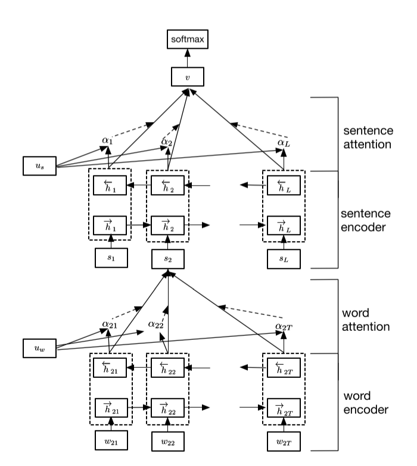
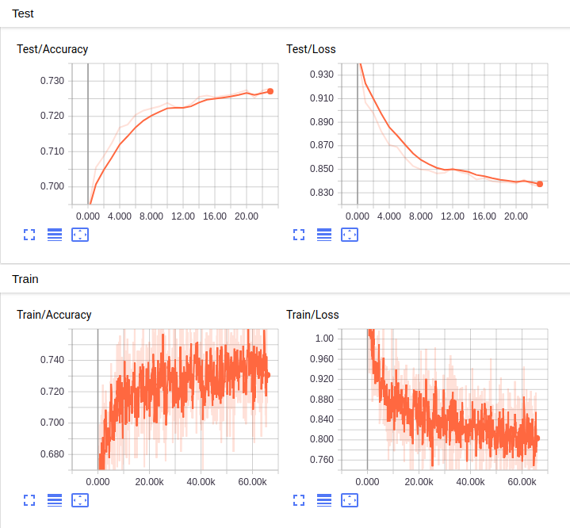
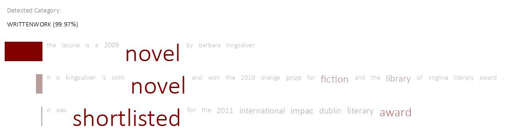
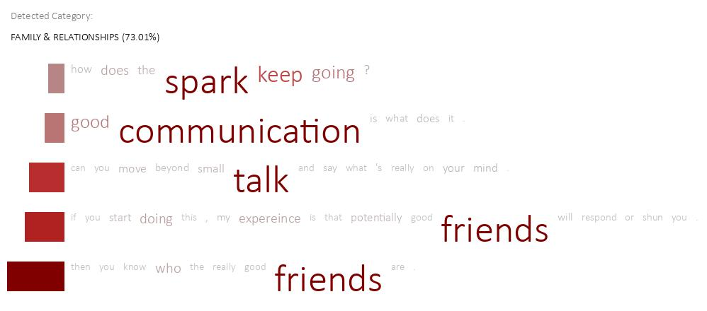

# Heirarchial_Attention_networks

- Hierarchical Attention Networks (HAN) is a neural network architecture that has been designed to process and understand hierarchical structures in text data. It is particularly useful for tasks that involve analyzing text at multiple levels of granularity, such as document classification, sentiment analysis, or document summarization.
- Since documents have a hierarchical structure (words form sentences, sentences form a document), HAN model likewise construct a document representation by first building representations of sentences and then aggregating those into a document representation.
- HAN consists of two levels of attention mechanisms: word-level attention and sentence-level attention.
- In this repo, HAN is used for document classification of datasets **dbpedia** and **yahoo_answers**.
- Link to datasets [dbpedia,yahoo_answers](https://drive.google.com/drive/folders/1P-aVltYqZ6jl6fkGenG-Lu6FKLRLtJ0e?usp=drive_link).
- Link to pretrained models [model](https://drive.google.com/drive/folders/1-kGccYP6imTtKGl6_Jc7o1NKrX0ATeLx?usp=drive_link)
## HAN_model

## Training 
### dbpedia

### yahoo_ansers

## Results 
- Font size of word represents normalized attention weight
### dbpedia

### yahoo_answers

